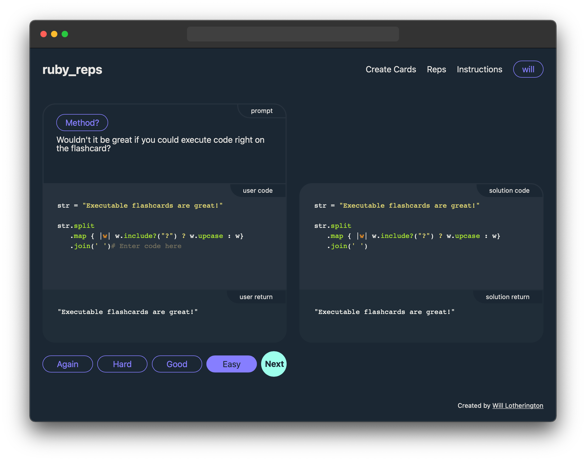

# `ruby_reps`

* **Try it out:** [http://www.rubyreps.com/](http://www.rubyreps.com/)
* **Stack:** `Ruby`, `JavaScript`, `jQuery`, `Sinatra`, `codemirror`
* **Feedback:** [Will.Lotherington@hey.com](mailto:Will.Lotherington@hey.com)

### What is it?
`ruby_reps` is a flashcard app specifically designed for Ruby programmers.

### What is unique about it?
* Computational flash cards
* Spaced Repetition
* Pre-loaded cards

### What is a computational flash card?
With traditional flash cards you read the front of the card, think of the answer in your head, and check the back to see if you're right. A computational flashcard allows you to enter and execute actual code!

### What is spaced repetition?
If you are learning something new, it is important to review the material frequently. After you've internalized the material you probably only need to review it once every several weeks/months to make sure you don't forget it. `ruby_reps` uses a spaced repetition algorithm to optimize the frequency that you review the various methods.

### Why?
Similar to learning a natural language, there are various components to practice when learning a programming language:

|Natural|Programming|How to practice|Flashcards|`ruby_reps`|
|:-:|:-:|:-:|:-:|:-:|
|Vocabulary|Methods|Recall|Yes|Yes|
|Grammar|Syntax|Muscle Memory|No|Yes|